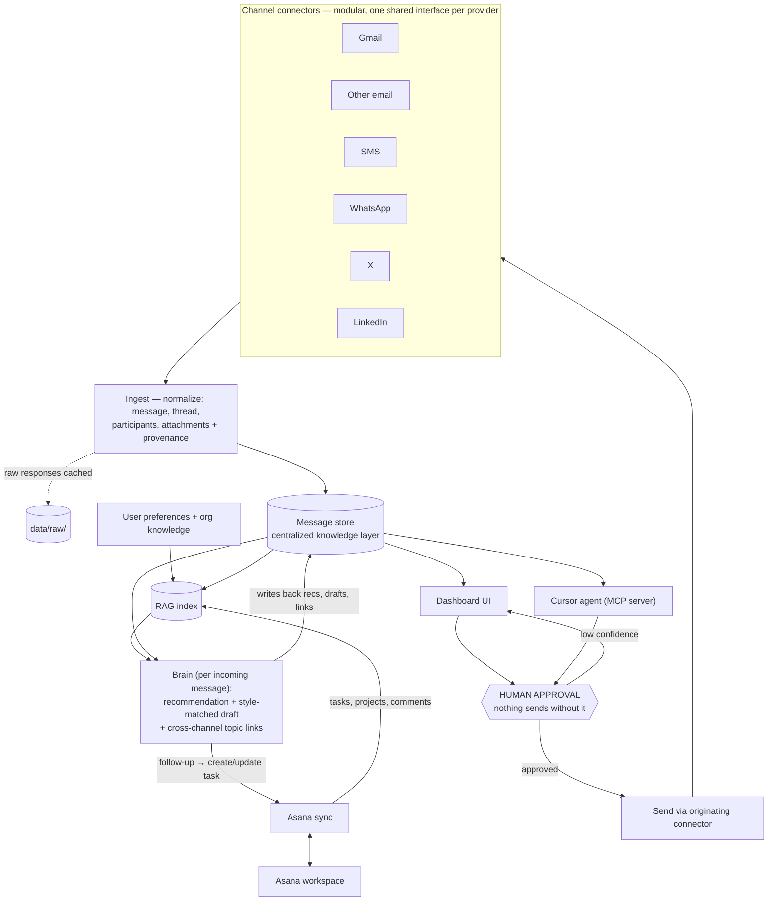

# chief-of-staff-communication-agent — Internal Context

## Rules
1. This is the only internal documentation file in this repo. AI context, decisions, ops patterns, and lessons all go here.
2. README.md is the acceptance contract (criteria + demo expectations). Never edit it to match the code — the code moves toward it, not the other way.
3. If this file disagrees with the code, **the code wins** — fix the doc.
4. Document a decision *after* it's made and proven, not before.
5. Never create conflicting concepts or logics in this document.
6. No PBI files, agent_reflections, delegation templates, multi-agent orchestration, ADRs, pre-implementation specs. Single-developer pace; agile + documentation-late. (Inherited from the oracle-pipeline sibling / polishy lineage.)

## Reality hierarchy
Code files are plans — what *should* exist. The message store, the connected accounts, the RAG index, and the Asana workspace are reality — what *does* exist. When they disagree, reality is right.
- Any claim about ingested messages cites raw output: a live store query, a connector sync log, an actual API response. Never summarize what the connector code should have fetched and present it as state.
- Never fabricate a message id, thread, account name, Asana task URL, or count that merely "looks right." Verify (a live query, an API call) or ask.
- (Origin: an ancestor validator shipped against a table that existed only as a SQLAlchemy model. "If it's not in the live schema, it doesn't exist.")

## Naming
- **channel** — one communication medium: gmail, other-email, sms, whatsapp, x, linkedin (extensible)
- **connector** — the per-channel integration module (modular connector architecture is an acceptance criterion)
- **account** — one authenticated identity on a channel; brands × channels give multiple accounts
- **message / thread** — normalized units in the store, with participants, timestamps, metadata, attachments where available
- **topic link** — a cross-channel association: messages that belong to the same person, customer, project, or decision
- **recommendation** — the suggested next action attached to an incoming message
- **draft** — a style-matched suggested reply, always awaiting approval
- **approval** — the human gate; nothing sends without it
- **knowledge layer** — the centralized store + RAG index over comms history, Asana context, user preferences, org knowledge
- **the agent** — a deliverable: the Cursor-accessible agent that retrieves context through the RAG layer, recommends actions, drafts replies, updates Asana. Everywhere the README says "agent", it means this shipped component — NOT Claude Code. Claude Code is the builder; the agent is built, tested, and demoed as product.

## Business context (flagship: the Notion page)
This project is a **Prism job-trial assignment** (AI Architect / Architectural Operator role) — the second of two. README.md is the "homework doc" (user story); the business context lives in Notion: [Prism Agent Dev Trial](https://app.notion.com/p/arthurcho/Prism-Agent-Dev-Trial-396b8d53366080f7b984d2c2bcaa32c1) — child page "Email comms" has the full brief, and this project's consolidated business context is maintained on the child page [chief-of-staff-communication-agent](https://app.notion.com/p/396b8d53366080a6bfb6ff640cfa6682) (keep it in sync when business facts change; engineering context stays here). Key facts:
- **Deliverable**: a pull request to `prismteam-ai/chief-of-staff-communication-agent` containing a short demo video + instructions/access to a **live/working runtime**.
- **Grader**: the `slowking` agent in soofi-xyz-team-kit (cloned at `../refs/soofi-xyz-team-kit`). Rubric (verified 2026-07-07, same as sibling): Functional outcome 40, Runtime & demo 20, Evidence 12, Access-boundary 8, Implementation 7, Kit-usage 5, Reproducibility 4, Speed 4. **Hard gates, automatic 0/100**: no publicly hosted runtime URL (localhost/tunnel-to-own-machine/local-setup = instant fail); missing PR; unreachable or login-blocked runtime — slowking gets ONE operator-assisted access attempt, so working demo credentials must ship with the PR. Self-assess with slowking before submitting.
- **Speed of delivery** is one of the biggest assessment factors (elapsed time measured from commit timestamps). Quality is the assumed baseline; mistakes are acceptable only when codified into skill/agent improvements so they don't repeat.
- Prism's working model: work **through** prebuilt skills/agent kits and improve them when they break — don't solve ad hoc; codify. Kit-usage is a scored dimension, and it's not vibes: slowking consults **`arceus`** (the kit's master router) as the answer key for which agents/skills *should* have built each part. Expected owners for this build (kit survey 2026-07-08): **chatot** (`manage-communication-activity` — provider adapters, send/delivery/response lifecycle), **oranguru** (`assemble-communication-runtime`), **xatu** (`select-communication-audience`), **wigglytuff** (`manage-channel-templates`) for comms; **ash** (`build-ai-agents` — Asana-triggered Lambda agent with human-in-the-loop approval task; closest pattern to this product) for the agent; **espeon/alakazam** (`build-local-rag-pocs`/`build-rag-systems`) for RAG; **metagross** (`build-frontend-backends`) for the dashboard; **donphan**'s MCP pattern for the Cursor surface. Name these mappings in the submission.
- **Kit golden path** (`apply-engineering-guidelines`, verified 2026-07-08) — deviations cost kit-usage/implementation points (~12/100 max exposure): TypeScript for all services (Python only for Glue/PySpark); **all LLM calls through the Vercel AI SDK** with Zod tool schemas — direct provider SDKs forbidden; AWS + CDK as the only IaC; Vitest, Prettier+ESLint, structured logging.
- First assignment (`oracle-property-intelligence-platform-pipeline-completion`) is the sibling repo — out of scope here, but its CLAUDE.md is this doc's ancestor.
- **Original job posting** (Notion child page "pervious job requirements (maybe outdated)" — dated context, treat as background not requirements): role is "Architectural Operator", not traditional engineering — design systems that produce software; "agentic layering" (agents that create/orchestrate/evolve other agents); decompose business functions into agentic workflows; contribute to the open-source soofi.xyz library. **Prism's embedded stack is AWS serverless: Lambda, Step Functions, DynamoDB** — the team kit's Lambda-first patterns (`build-ai-agents`, `build-rag-systems`) reflect it. Values A2A-protocol fluency and working through existing agent frameworks rather than from scratch. Their best performer "thinks in systems, not tasks." Enterprise clients (insurance, capital markets).

## Concept
Build a **Chief of Staff Communication Agent**: connect all major comms channels (Gmail + other email, SMS, WhatsApp, X, LinkedIn) through a modular connector architecture; ingest messages/threads/participants/attachments into one centralized knowledge layer; RAG over comms history + Asana + user preferences + org knowledge; for every incoming communication produce a recommendation and a style-matched draft; link messages cross-channel by topic; create/update Asana tasks for follow-ups; require human approval before anything sends; track answered/unanswered against a <5-minute response goal; ship a dashboard UI (volume, status, overdue, pending approvals, channel breakdown, response times) plus views for recommendations and drafts-awaiting-approval; and expose the whole thing as a Cursor-usable agent. The README's acceptance criteria are the original requirements — all "done" claims trace back to them, never to a derived plan or todo list.

Central design tensions to resolve:
1. slowking hard-fails anything not publicly hosted, but this product holds private comms and OAuth tokens. The demo must run on **dedicated demo accounts** (fresh Gmail, sandbox SMS/WhatsApp numbers, test X/LinkedIn) — never Arthur's real accounts — with demo credentials shipped so slowking can log in and exercise it.
2. Channel breadth (6+ integrations) vs speed-of-delivery scoring. The connector architecture must make each additional channel cheap, and the demo needs "multiple channels" end-to-end — not necessarily every channel at production depth. Which channels get real APIs vs a webhook/inbound-gateway path is an Open question.

## Phasing / Status
Updated as work lands. Current phase in **bold**. DONE: 1 (meta kit), 2 (creds/tooling), 3-5 as spine v0 (fixture connectors all 6 channels → store → RAG → brain → approval-gated send, live-tested 2026-07-08, local commit 39c977d; slowking shadow ≈48/100, formal 0 until hosted).
6. **Asana** — link comms to tasks/projects; create/update tasks from communications (needs workspace + PAT from Arthur)
7. **UI** — dashboard, recommendations view, drafts-awaiting-approval view, approval flow (top shadow-points recovery after hosting)
8. **Cursor agent** — MCP surface over the RAG layer + actions
9. Corpus scale — grow fixtures from 12 messages to realistic volume + commit RAG seed script (toy data caps every band)
10. Real connectors — Gmail first (needs demo account + OAuth app), then Twilio SMS/WhatsApp when unparked
11. Hosting + demo — public runtime (Azure Container Apps proposal), demo credentials, demo video, PR; slowking self-assessment before submitting. NOTHING deploys/pushes until Arthur says so.

## Tech stack
Proven choices only; open choices live in Open questions.
- **Python via uv** — Arthur decided (2026-07-08), overriding the kit's TypeScript mandate for this repo. uv discipline: `uv add`/`uv sync`/`uv run`, lock everything explicitly, never rely on a transitively-arrived package. Deviation bundle documented once: Python instead of TS, and LLM calls via the official `openai` package in Azure mode instead of the (TS-only) Vercel AI SDK. Rationale: owner preference + speed; exposure limited to kit-usage/implementation dimensions.
- **Azure OpenAI for LLM + embeddings** — Arthur has creds (2026-07-08). Powers recommendations, drafting, style-matching, RAG embeddings.
- **Supabase for the store** — Arthur has creds (2026-07-08). Postgres + pgvector: messages AND RAG vectors in one database; Supabase auth covers the demo login slowking needs.
- **Netlify for the UI** — Arthur has an account (2026-07-07). Hosts the dashboard. **Verified 2026-07-08: Netlify Functions run TS/JS/Go (+experimental Rust) — NOT Python** — so the Python backend (connectors, webhooks, brain, MCP) needs its own host (see Open questions). Known deviation from the kit's AWS+CDK path — accepted for speed.
- **MCP for the Cursor agent** — "an agent usable directly in Cursor" is naturally an MCP server Cursor connects to; MCP is also how the agent retrieves RAG context and performs Asana actions. (A2A remains an option for agent→agent interop, per sibling; not an acceptance criterion here.)
- Secrets via env vars only — never in committed config. OAuth tokens live in the runtime's secret store, not the repo.
- macOS-local dev; **the demo runtime itself must be publicly hosted** — README requires a live/working runtime in the PR and slowking auto-fails localhost. Only channel *depth* may be simulated (sandbox numbers, fixture corpora); the app never is.

## Credentials & tooling (verified 2026-07-08; values live in `.env`, gitignored — see `.env.example`)
- **Azure OpenAI, chat** — key + endpoint (`foundry-memoirji-test.openai.azure.com`) sourced from cheleq. Deployments verified live: `gpt-5.2`, `gpt-5.4`, `gpt-5.4-mini`. NOTE: this resource is NOT in any az-manageable subscription (external tenant; cheleq holds only the data-plane key) — nothing can be deployed/changed on it, only consumed.
- **Azure OpenAI, embeddings** — `text-embedding-3-small` (1536 dims) verified live on **`cheleq-alpha-3`** (cheleq rg, swedencentral) — already deployed, az-manageable, key via `az cognitiveservices account keys list`. Separate env vars: `AZURE_OPENAI_EMBED_*`.
- **Azure subscription** — az CLI logged in, "Microsoft Azure Sponsorship" default (5 more enabled subs). Azure hosting (Container Apps / Functions) is therefore viable for the Python backend.
- **Supabase** — account access token sourced from cheleq. Dedicated project created 2026-07-08: **`chief-of-staff-comms`** (ref `frhromdjjmczranjcnfz`, us-east-1, memoirji org), pgvector 0.8.2 enabled, REST verified. Hard rule from Arthur: NEVER touch the org's other projects (cheleq/kashi/polishy/etc.) — all work goes through this ref only. `.mcp.json` scopes the Supabase MCP server to this ref (restart session to connect it).
- **Netlify** — personal access token sourced from grandjury's `.mcp.json` (2026-07-08, per Arthur); verified against the API (account torezu@pm.me, 6 sites).
- **Twilio** — live SID/token/number exist in cheleq (`bot_lite/.env`); Arthur said leave it for now — do not copy until he says so.
- Key-shape note (learned 2026-07-08): new Supabase projects issue both legacy JWT keys and new `sb_publishable_`/`sb_secret_` keys; the REST root introspection endpoint answers only to service_role — a 401 with the publishable key there is normal, not breakage.

## Architecture
Grows as built. Intended flow:

- One connector interface, one shared HTTP/auth path per provider: one fetch function, one error surface, one log shape.
- Raw provider responses are cached to `data/raw/` — never re-fetch what we already have; re-parsing is free, re-fetching burns rate limits.
- Every stored message carries provenance: channel, account, provider message id, fetched_at, raw-record pointer. This is what lets any recommendation or draft cite its sources.

## Verification discipline
- When listing options or feasibility ("we can / we could / we just need"), classify each claim: **verified** (I checked), **industry-default assumption**, or **unknown**. Label all items when mixed. A cheap curl or doc-read before claiming beats an "are you sure" cycle after. This matters double here: X and LinkedIn API access are famously constrained — never assume a scope or tier from memory.
- "Done" requires evidence: file:line for code claims, live query/API output for data claims. Traceability format when auditing: `Criterion | Evidence | PASS/FAIL/PARTIAL`. No percentage-complete claims, ever.
- **Ingest gate** — a channel connector is "working" only when: messages queried live from the store with correct thread/participant structure, per-account sync status reviewed, errors reviewed. Not when the sync script exits 0.
- **Send gate** — any send path is "working" only when demonstrated against a demo/sandbox account with the approval step observed in between. There is no headless send test against real accounts, ever.
- Pattern bug found in one place → `grep -r` the whole repo immediately; fix every occurrence.
- Validate against README acceptance criteria, not against a plan derived from them. (Origin: a validator once passed 4/5 requirements as 5/5 because it checked the implementation plan instead of the original spec.)

## External providers
- Never write a connector against a provider API from memory. WebFetch the docs or probe with a live call first to confirm endpoints, scopes, rate limits, and payload shapes. Same for Asana.
- Be polite: honor rate limits, back off on errors, cache aggressively.
- Document provider constraints here as discovered (this table is the deliverable behind the modular-connector and multi-provider criteria):

| Provider | Constraint | Noted |
|---|---|---|
| _(none yet)_ | | |

## Cost discipline
- Note per-run cost next to any design decision that introduces a paid API (Twilio, LLM calls, embeddings, hosting).
- No Opus-tier models inside the recommendation/drafting loop — context growth makes them ~5x the cost per run. Reserve heavy models for one-shot synthesis; the per-message loop runs on a cheap fast model until quality data says otherwise.
- Anti-fabrication gate: every recommendation, draft claim, and dashboard statistic carries a source (a message id, a query, an Asana URL) or is explicitly marked unverified.

## Engineering defaults
- **Mock-first dev loop**: fixture message corpora per channel behind a flag, so ingest, RAG, brain, and UI iterate fast without live provider calls or rate-limit burn. The fixture corpus doubles as demo seed data.
- **Defensive parsing**: never trust the shape of anything a provider webhook or an LLM returns. Malformed payloads go to an error sidecar (with the raw input); one bad message never kills a sync; one failed connector never aborts an ingest run.
- **Errors are loud, silence is a bug**: an empty sync from a connected account routes to a warning, not a quiet zero.
- Parallel connector syncs use `allSettled` semantics — collect failures, keep the rest.
- UI: lifted state, single source of truth, children controlled.
- Prompts use dynamic injection only — no hardcoded example names/content in prompt templates (see Learned the hard way).

## Working style
- Don't guess requirements when Arthur can be asked — he has the accounts, credentials, brand list, and Asana workspace this agent doesn't.
- A hedged musing ("i think X?" / "isn't Y?") is not a go. Wait for an action verb (do it, ship it, build it) before implementing anything from an exploratory discussion.
- Debugging >30 min without progress → stop and ask. Isolate the layer first (provider / data / code) before trying fixes.
- Don't add features, refactors, or abstractions beyond what the task requires. When Arthur says simple, build simple.
- Don't write a one-off script when an existing tool, MCP server, or kit skill already does it — check `../refs/soofi-xyz-team-kit/skills/` first; kit-usage is scored.
- Audit whole config files before commit — a partial edit can silently revert neighboring fields.
- Run the tests before every commit. No untested pushes.
- Sub-agents get narrow, checklist-shaped lookups only. Synthesis, design, and judgment stay in the main thread.
- No timeline projections ("week 1", "2-3 days"). Surface dependencies and blockers instead.

## Learned the hard way
Append one dated, quotable rule here in the same commit as the fix that taught it. Seeded from the ancestors:
- (inherited) Lock every dependency explicitly — uv installed `aiohttp` transitively, prod pip didn't, deploy "COMPLETE" claim preceded a `ModuleNotFoundError` crash.
- (inherited) Validate against the original requirements, never a derived plan — that's how 4/5 became "all five requirements successfully implemented."
- (inherited) Never emit an infra URL/identifier that merely looks right — a fabricated-but-plausible deploy URL made it into a report while the real one sat in the docs.
- (inherited) Editing one field of a synced config file re-applies every other field — read the whole file, then push.
- (inherited) Hardcoded examples in prompts leak into output — an interview bot greeted real users as "Sarah" from its few-shot examples. Dynamic injection only.

## Do NOT regress
Invariants to preserve; add as they're won.
- **Approval gate is absolute**: no code path sends a message without an explicit human approval recorded first. Not in tests, not in demos, not "just this once." This is both an acceptance criterion and the product's safety core.
- Demo runs on dedicated demo/sandbox accounts only — never Arthur's real Gmail/phone/X/LinkedIn. A runaway send on a real account is unrecoverable.
- No secrets/tokens in committed config — env-var references only. This repo becomes a public PR; OAuth token leakage here is a live-account compromise, not just hygiene.
- Provenance columns are never dropped "for simplicity" — source-backed recommendations are the product.
- The demo runtime must be publicly hosted at a reachable URL; demo login credentials ship with the PR (login-blocked = automatic 0/100 from the grader).

## Design decisions
Dated one-liners, recorded after proven.
- 2026-07-08 — Python via uv for this repo (Arthur's call), accepting the kit's TS/Vercel-AI-SDK deviation as one documented bundle.
- 2026-07-08 — Azure OpenAI for LLM + embeddings; Supabase (Postgres + pgvector) as the single store for messages, vectors, and demo auth; Netlify for the dashboard UI.
- 2026-07-08 — Netlify verified NOT to run Python functions (TS/JS/Go only) → backend host is a separate decision (Azure vs Render), pending Arthur.
- 2026-07-08 — Dedicated Supabase project `chief-of-staff-comms` (ref `frhromdjjmczranjcnfz`) created in the memoirji org via management API; pgvector enabled; keys in `.env`; MCP server scoped to it in `.mcp.json`. Isolation from all other org projects is a standing rule.

## Open questions
- Demo account inventory (needs Arthur, per channel):
  - Gmail — fresh demo Google account + Google Cloud OAuth app (test-mode consent screen suffices)?
  - Second email provider ("beyond Gmail" is an explicit AC) — Outlook vs a generic IMAP connector (cheapest honest satisfier)?
  - SMS/WhatsApp — Twilio creds exist in cheleq (`bot_lite/.env`); Arthur to approve reuse (or provision a separate number for this demo).
  - X — free API tier posts but cannot read DMs (verified constraint class; exact current tier limits to re-verify at build time). Paid tier available, or ship "connector built, constraint documented"?
  - LinkedIn — no official messaging API for personal accounts; plan is a gateway/mock connector proving modularity + documented constraint, unless Arthur knows otherwise.
- **Python backend host**: Azure subscription confirmed deployable (2026-07-08) — proposal: **Azure Container Apps with scale-to-zero** for the FastAPI backend (webhooks + API + MCP + scheduler in one container; wakes on HTTP; near-zero cost at rest). Not *pure* serverless: the MCP SSE surface and the sync scheduler want a process, not per-request functions. Confirm with Arthur before first deploy.
- Cursor MCP surface: remote MCP (SSE/HTTP) served by the Python backend — host follows the backend-host decision.
- Style learning: few-shot from sent messages at draft time vs a distilled style profile? Demo persona needs a seeded sent-history corpus (fresh demo accounts have none).
- Asana: which workspace for the demo; PAT (fastest) vs OAuth?
- "Setup simple enough for non-technical users" — what the demo visibly shows: a connect-your-accounts onboarding flow, or guided docs? (Acceptance criterion; needs a visible answer.)
- Response-time tracking: what starts the <5-minute clock (ingest time vs provider timestamp) and what stops it (approval vs actual send)?
- Do we commit the meta kit (CLAUDE.md, .claude/) to the assignment repo? Sibling leans yes — Prism scores kit-usage and values codified skills — but Arthur decides.

## Not doing
- Auto-send without approval (see Do NOT regress) — even as an opt-in flag
- Real-account integrations for the demo — sandbox/demo accounts only
- Multi-tenant/team features beyond what the criteria require — single executive user until the demo passes
- Building all six channels to production depth before the spine (store → RAG → brain → approval) works end-to-end on one channel
- PBI/reflection/orchestration apparatus (see Rules)

## Recent milestones
- 2026-07-07 — Agent spawned per SPAWN.md; ancestors confirmed with Arthur (oracle-pipeline sibling + breeds/refs kit); business context read (Notion trial page + Email comms brief); slowking rubric confirmed shared with sibling; meta kit built (this doc, 3 skills).
- 2026-07-07 — Original job posting surfaced (dated): Architectural-Operator framing, agentic layering, AWS-serverless embedded stack — folded into Business context and the RAG/hosting open questions.
